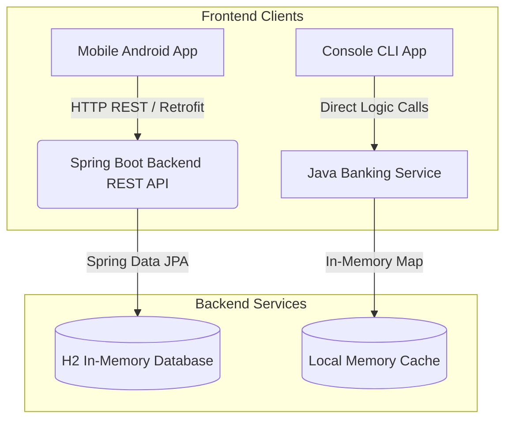

# 🏦 Full-Stack Banking System

A robust, enterprise-grade **Full-Stack Banking System** simulating core banking workflows. The system features a tiered architecture spanning a **Spring Boot REST API** backend, a **Native Android Client** frontend, and a **Command Line Interface (CLI)** client for quick testing.

<div align="center">
  
  
  
  
  
  
</div>

---

## 📐 System Architecture

This project is built using a modern, decoupled client-server architecture:



---

## ✨ System Features

### 🖥️ 1. Spring Boot REST API (Backend)
Built using a clean **Controller-Service-Repository** layered architecture:
*   **Security & Persistence:** Secure user registration, authentication, password hashing, and persistent transaction mapping.
*   **Transactions:** Secure deposit, withdrawal, and peer-to-peer transfers wrapped in Spring's `@Transactional` annotations to prevent database inconsistency and race conditions.
*   **Embedded Database:** Uses an in-memory **H2 Database** with a live console viewable at `/h2-console` for easy testing.
*   **Schema Persistence:** Automatic schema updates managed by Hibernate ORM.

### 📱 2. Native Android App (Mobile Frontend)
A clean Kotlin/Java Android client allowing users to manage accounts on the go:
*   **HTTP Networking:** Uses **Retrofit** and **OkHttp** to communicate asynchronously with the Spring Boot backend REST endpoints.
*   **Authentication:** Interactive login and sign-up layouts interacting with backend token models.
*   **Account Dashboard:** Retrofits response objects to display live account details and balances.

### 💻 3. Console CLI Client
An offline, self-contained Java console application:
*   **Object-Oriented Design:** Demonstrates core OOP concepts (Encapsulation, Polymorphism, Inheritance).
*   **Interactive Shell:** CLI prompt menu mapping to custom deposit, withdrawal, transfer, and history workflows.

---

## 📂 Project Structure

```text
├── src/main/java/com/bank/             # Spring Boot REST API
│   ├── controller/                     # REST API Controllers (REST Endpoints)
│   ├── service/                        # Enterprise Business Logic (@Service)
│   ├── repository/                     # Database Repositories (Spring Data JPA)
│   └── model/                          # Database Entities (JPA / Hibernate)
│
├── src/                                # CLI Application package
│   ├── combankmodel/                   # Console Account & Transaction models
│   ├── combankservice/                 # In-Memory banking routines & utility
│   └── MainApp.java                    # Console interactive terminal entry
│
├── mobile/                             # Native Android App
│   └── app/src/main/
│       ├── java/com/bank/mobile/       # UI Activities & api package
│       └── res/layout/                 # Android GUI layouts (XML)
│
└── pom.xml                             # Maven configuration & dependencies
```

---

## 🚀 Getting Started

### Prerequisites
*   **JDK 17** or higher
*   **Apache Maven** installed
*   **Android Studio** (for running the mobile application)

---

### Step 1: Booting up the Backend REST API
Run the Spring Boot server from the project root directory:

```bash
# Compile and package the application
mvn clean install

# Run the Spring Boot application
mvn spring-boot:run
```
Once started, the server runs on `http://localhost:8080`.
*   **Access the API Console:** Visit `http://localhost:8080/h2-console` to view the in-memory SQL database.

---

### Step 2: Running the Console Client
To test the console-based banking terminal, compile and run the CLI package directly:

```bash
# Compile the console program
javac src/MainApp.java src/combankmodel/*.java src/combankservice/*.java

# Run the terminal loop
java -cp src MainApp
```

```text
Welcome to the Banking System
-----------------------------
1. Create Account
2. Deposit
3. Withdraw
4. Transfer
5. Check Balance
6. Transaction History
7. Exit
```

---

### Step 3: Running the Android Application
1.  Open the `mobile/` directory in **Android Studio**.
2.  Open `mobile/app/src/main/java/com/bank/mobile/api/ApiClient.java` and update the `BASE_URL` to point to your backend server IP:
    ```java
    private static final String BASE_URL = "http://10.0.2.2:8080/"; // Localhost tunnel in Android Emulator
    ```
3.  Sync Gradle dependencies, compile, and run on a virtual device (AVD) or a physical Android phone.

---

## 🛠️ Tech Stack & Key Libraries
*   **Backend:** Java 17, Spring Boot, Spring Data JPA, H2 Database, Hibernate, Lombok
*   **Mobile:** Java/Kotlin, Android SDK, Retrofit, OkHttp, XML layouts
*   **Build Systems:** Maven, Gradle
